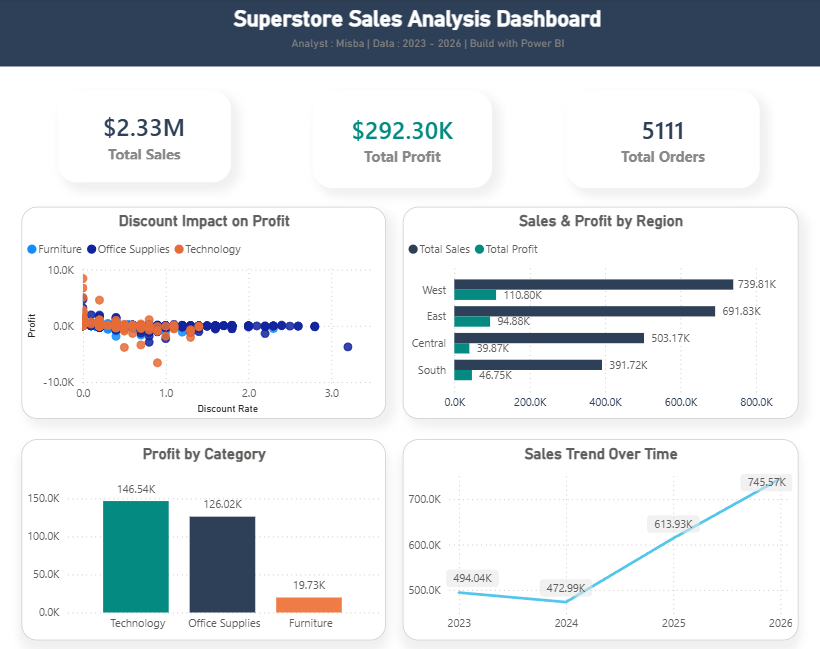

# 🛒 Superstore Sales Analysis — End to End Data Analyst Project



## 📌 Project Overview

This is a complete end-to-end data analysis project on the Sample Superstore dataset.
The goal was to analyze 4 years of retail sales data (2023–2026) and extract actionable
business insights to help improve profitability.

This project covers the full data analyst workflow:
**Data Cleaning → SQL Analysis → Power BI Dashboard → Business Insights**

---

## 🎯 Business Problem

A retail superstore is generating $2.3M in revenue but struggling with thin profit margins.
The goal of this analysis was to answer:

- Where is the business making money?
- Where is the business losing money?
- What is the root cause of losses?
- What should the business do to improve profitability?

---

## 📊 Dashboard Preview


**Live Dashboard built in Power BI with 5 visuals:**
- KPI Cards — Total Sales, Profit & Orders
- Sales & Profit by Region — Clustered Bar Chart
- Sales Trend Over Time — Line Chart
- Profit by Category — Column Chart
- Discount Impact on Profit — Scatter Plot

---

## 🔑 Key Findings

| # | Finding | Impact |
|---|---------|--------|
| 1 | Revenue grew **51%** from $493K (2023) to $745K (2026) | Positive growth trend |
| 2 | **West region** leads with $739K revenue & 14.98% margin | Best performing region |
| 3 | **Central region** has only 7.92% margin despite $503K revenue | Needs attention |
| 4 | **Technology** is star category — $146K profit at 17.45% margin | Focus area |
| 5 | **Furniture** is biggest problem — only 2.61% margin | Problem area |
| 6 | Discounts above **20%** consistently generate losses | Critical finding |
| 7 | **$125,507** profit destroyed by excessive discounting | Biggest opportunity |
| 8 | **Texas** is 3rd highest revenue state but losing -$25,729 | Loss making state |
| 9 | **Tables** sub-category losing -$17,753 on $208K revenue | Fix immediately |
| 10 | Capping discounts at 20% could recover **43% more profit** | Key recommendation |

---

## 💡 Key Business Recommendation

> **The single biggest opportunity to improve profitability is capping all discounts at 20%.**
> This alone could recover up to $125,507 in lost profit — a 43% improvement in total profit.

---

## 🗂️ Project Structure

```
superstore-analysis/
│
├── data/
│   └── samplesuperstore.csv          # Raw dataset (9,994 rows, 21 columns)
│
├── sql/
│   └── queries.sql                   # Complete SQL analysis (5 sections)
│
├── powerbi/
│   └── superstore_dashboard.png      # Final dashboard screenshot
│
├── analysis_questions.md             # Business questions defined before analysis
├── data_dictionary.md                # Column descriptions and data types
├── data_quality_report.md            # Data cleaning steps and findings
├── insights.md                       # Complete business insights (12 sections)
└── README.md                         # You are here
```

---

## 🛠️ Tools & Technologies

| Tool | Purpose |
|------|---------|
| **SQL (PostgreSQL)** | Data cleaning, exploration, business queries |
| **Power BI** | Interactive dashboard and data visualization |
| **Power Query** | Data transformation and cleaning in Power BI |
| **Markdown** | Documentation and project reporting |

---

## 📁 Dataset Information

| Property | Value |
|----------|-------|
| Source | Sample Superstore (Public Dataset) |
| Rows | 10,194 (raw) → 10,192 (after cleaning) |
| Columns | 21 (raw) → 17 (after removing redundant columns) |
| Date Range | 2023 – 2026 |
| Geography | United States |
| Currency | USD |

---

## 🔍 SQL Analysis Sections

The SQL analysis covers 5 complete sections:

1. **Data Quality Assessment** — Null checks, duplicate detection, data validation
2. **Revenue & Profit Overview** — YoY growth, monthly trends, profit margins
3. **Regional Performance** — Region and state level analysis, loss-making states
4. **Product Performance** — Category, sub-category and product level profitability
5. **Customer & Discount Analysis** — Segment analysis, discount impact on profit

---

## 📈 Business Insights Summary

### Revenue & Growth
- Total Revenue: **$2,326,154** across **5,111 orders**
- Total Profit: **$292,274** with **12.56%** profit margin
- Revenue grew **51%** over 4 years — healthy, sustainable growth

### Regional Story
- **West** → Best region: $739K revenue, 14.98% margin ✅
- **Central** → Problem region: $503K revenue, only 7.92% margin ⚠️
- **Texas** → 3rd highest revenue but losing **-$25,729** ❌

### Product Story
- **Technology** → Star performer: $146K profit, 17.45% margin ✅
- **Office Supplies** → Hidden hero: $126K profit, 17.22% margin ✅
- **Furniture** → Biggest problem: only 2.61% margin ❌
- **Tables** → Worst sub-category: -$17,753 loss ❌

### Discount Story
- Orders with **>20% discount** consistently generate losses
- **31-50% discount range** loses average $155 per order
- Total profit destroyed by excessive discounting: **$125,507**

---

## 👤 About

**Analyst:** Misba
**GitHub:** [github.com/misba-coder](https://github.com/misba-coder)
**Project Type:** Personal Portfolio Project
**Role Target:** Data Analyst (Fresher)

---

## 📬 Contact

If you have any questions about this project or want to connect:

- GitHub: [github.com/misba-coder](https://github.com/misba-coder)

---

*This project was built as part of my data analyst portfolio to demonstrate
end-to-end analytical skills including SQL, data visualization, and business insight generation.*
